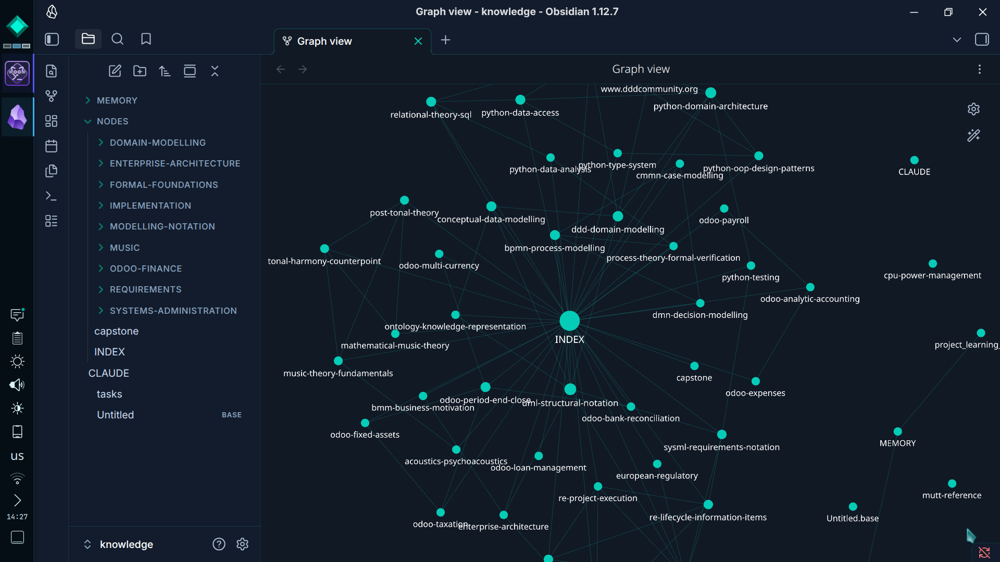
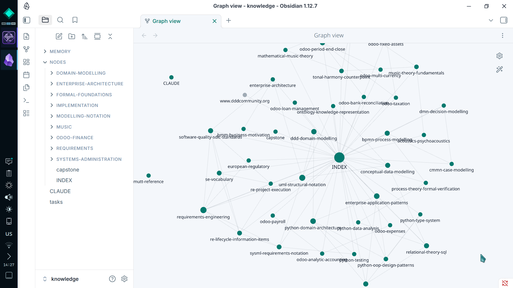

# Aletheum — Obsidian Theme

An Obsidian theme built on the [Aletheum](https://aletheum.io) brand design system. Supports both **dark** and **light** modes.

## Design

Aletheum's visual identity is built around a deep navy/midnight base, a signature teal accent (`#00CDB8`), and Inter as the primary typeface — chosen for clarity in long-form knowledge work.

| Mode  | Background      | Accent          | Text            |
|-------|-----------------|-----------------|-----------------|
| Dark  | `#081220` navy  | `#00CDB8` teal  | `#FFFFFF` white |
| Light | `#F4F7FB` cloud | `#007A6E` teal  | `#0A1628` navy  |

### Screenshots

**Dark mode**

**Light mode**

## Installation

### Community themes (recommended)

1. Open Obsidian → **Settings → Appearance → Themes**
2. Click **Manage** → search for **Aletheum** → Install

### Manual install

1. Copy `Aletheum/theme.css` and `Aletheum/manifest.json` into your vault's `.obsidian/themes/Aletheum/` folder
2. Activate via **Settings → Appearance → Themes**

## Features

- Full dark + light mode with AA/AAA accessible contrast ratios
- Inter typeface (300–500 weight) — clean and lightweight
- Teal H2 accent borders and crystal-motif empty states
- Frosted-glass command palette and modals
- Styled tables, callouts, blockquotes, tags, and checkboxes
- Minimal, thin scrollbars
- Graph view tuned to the teal palette

## About Aletheum

Aletheum is a technology company. Learn more at [aletheum.io](https://aletheum.io) or reach us at [brand@aletheum.io](mailto:brand@aletheum.io).

## License

MIT © [Aletheum](https://aletheum.io)
